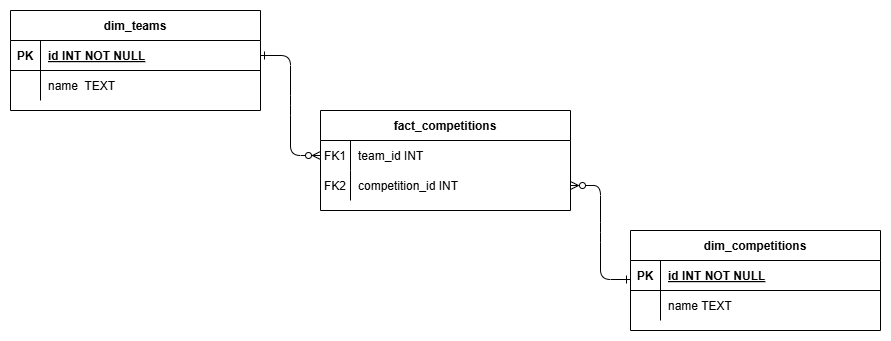

# 👋 Introduction

**This project is designed to demonstrate a data engineering pipeline that ingests data from an API, processes and transforms it, and loads it into a relational database. 
Finally, output a CSV file summarizing the number of teams per competition in descending order.**


## Table of Contents
1. [Repository Structure](#-repository_structure)
2. [Datawarehouse](#-datawarehouse)
3. [Quick Start](#-quick-start)
4. [Requirements]()

## ETL Process


## Datawarehouse
The ETL process creates a data warehouse as illustrated below:



## Repository Structure
The project structure is organized as follows:

```
ETL_API_FOOTBALL/
├── app/
│   ├── __init__.py
│   ├── main.py
│   ├── etl/
│       ├── __init__.py
│       ├── extract.py
│       ├── transform.py
│       └── load.py
├── tests/
│   ├── __init__.py
│   ├── test_extract.py
│   ├── test_transform.py
│   └── test_load.py
├── data/
│   └── raw/
├── db/
│   └── schema.sql
├── output/
│   └── summary.csv
├── log/
│   └── etl.log
├── .env
├── requirements.txt
├── README.md
```


- **app/**: Contains the main application code.
    - **main.py**: The entry point for running the ETL pipeline.
    - **etl/**: Contains the ETL process scripts.
        - **extract.py**: Handles data extraction from the API.
        - **transform.py**: Manages data transformation logic.
        - **load.py**: Responsible for loading data into the database.

- **tests/**: Contains unit tests for the ETL process.
    - **test_extract.py**: Tests for the extraction process.
    - **test_transform.py**: Tests for the transformation process.
    - **test_load.py**: Tests for the loading process.

- **data/**: Directory for storing raw data files.
    - **raw/**: Subdirectory for raw data files.

- **db/**: Directory for database-related files.
    - **football_data.sql**: SQL schema for setting up the database.

- **output/**: Directory for storing output files.
    - **summary.csv**: CSV file summarizing the number of teams per competition.

- **log/**: Directory for storing log files.
    - **etl.log**: Log file for the ETL process.

- **.env**: Environment variables file containing sensitive information like API keys.

- **requirements.txt**: Lists the Python dependencies required for the project.

This structure ensures a clear separation of concerns, making the project easy to navigate and maintain.
The project structure is organized as follows:


## Quick Start

1. **Clone the repository:**
    ```bash
    git clone <repository_url>
    cd <repository_directory>
    ```

2. **Obtain API Token:**
    Register for a free API token [here](https://www.football-data.org/client/register).

3. **Configure Environment Variables:**
    Create a `.env` file in the root directory with the following content:
    ```bash
    API_KEY=<your_api_token>
    ```

4. **Set Up Virtual Environment and Install Dependencies:**
    ```bash
    python3 -m venv venv
    source venv/bin/activate
    pip install -r requirements.txt
    ```

5. **Run the Pipeline:**
    ```bash
    python app/main.py
    ```

6. **Run Tests (Optional):**
    ```bash
    python -m pytest .
    ```

7. **Check Test Coverage (Optional):**
    ```bash
    python -m pytest --cov=. --cov-report=term-missing
    ```

## Requirements

- Python 3.10 or higher (This project was built with Python 3.13.1)


